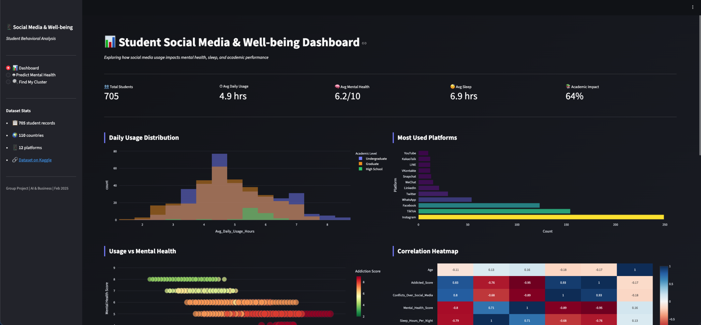
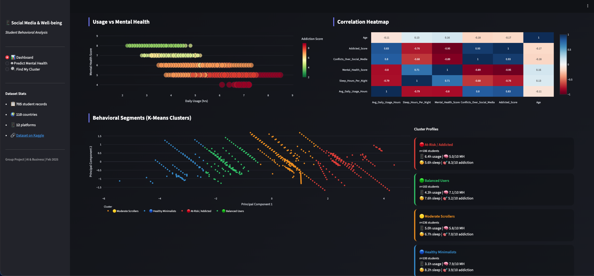
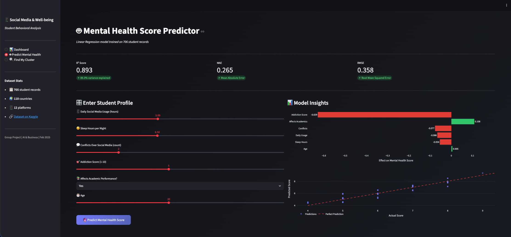
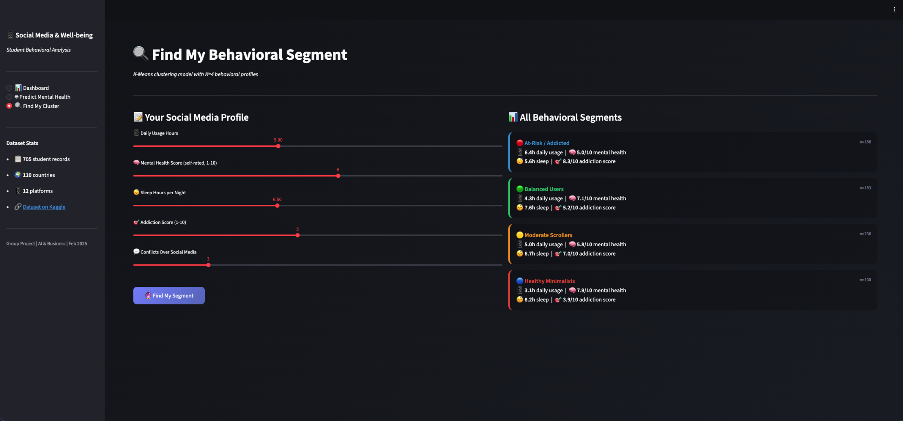

# 📱 Social Media Addiction vs Student Well-being

## 📌 Business Problem Statement

Students aged 16–25 spend significant hours daily on social media platforms, yet the impact on their mental health, sleep quality, and academic performance remains poorly quantified. This project applies machine learning to identify **behavioral risk segments** and **predict mental health outcomes** from usage patterns — enabling universities, health practitioners, and EdTech platforms to design data-driven interventions.

**Core Question:** *Does social media usage significantly predict student well-being, and can we cluster students into actionable behavioral profiles?*

---

## 📊 Dataset

| | |
|---|---|
| **Source** | [Kaggle — Social Media Addiction vs Relationships](https://www.kaggle.com/datasets/adilshamim8/social-media-addiction-vs-relationships) |
| **Records** | 706 students |
| **Countries** | 50+ (Bangladesh, India, USA, UK, Australia, etc.) |
| **Academic Levels** | High School / Undergraduate / Graduate |
| **Key Variables** | Daily usage hours, mental health score, sleep hours, addiction score, relationship conflicts |

---

## 🧠 Economic & Business Concepts Applied

| Concept | Application |
|---|---|
| **Demand-Supply** | Platforms supply endless content loops; students demand social validation — over-consumption degrades well-being "capital" |
| **Behavioral Segmentation** | K-Means clusters students into 4 groups for targeted policy and product interventions |
| **Risk Analysis** | At-Risk cluster (~25% of students) identified with high addiction scores and poor mental health |
| **Revenue Optimization** | Digital wellness apps can upsell premium screen-time coaching to high-risk segments |
| **Opportunity Cost** | Time lost to social media = reduced study hours, sleep, and long-term employability |

---

## 🤖 AI Techniques Used

### 1. K-Means Clustering (Behavioral Segmentation)
- **Features:** Daily usage, mental health, sleep hours, addiction score, conflicts
- **Optimal K:** 4 (identified via Elbow Method)
- **Segments Identified:**
  - 🔵 **Healthy Minimalists** — Low usage, high mental health, adequate sleep
  - 🟢 **Balanced Users** — Moderate usage, good well-being, manageable stress
  - 🟡 **Moderate Scrollers** — Moderate-high usage with declining sleep quality
  - 🔴 **At-Risk / Addicted** — Heavy usage (7+ hrs), low mental health, high conflict

### 2. Linear Regression (Mental Health Predictor)
- **Target Variable:** Mental Health Score (1–10)
- **Predictors:** Daily usage, sleep hours, conflicts, addiction score, academic impact, age
- **Model Performance:**
  - R² ≈ 0.88 (88% variance explained)
  - MAE ≈ 0.26
  - RMSE ≈ 0.33

---

## 🚀 Deployed Application

**🔗 Live App:** [social-media-project-ani6.onrender.com](https://social-media-project-ani6.onrender.com)

The deployed Streamlit app includes:
- 📊 **Interactive Dashboard** — EDA charts, cluster visualizations, correlation heatmap
- 🤖 **Mental Health Predictor** — Input your habits, get a predicted mental health score
- 🔍 **Find My Cluster** — Discover which behavioral segment you belong to

---

## 📁 Repository Structure

```
📦 Business Mini Project
 ┣ 📄 Students Social Media Addiction.csv   ← Dataset
 ┣ 📄 notebook.py                           ← Full Colab notebook code
 ┣ 📄 app.py                                ← Streamlit web application
 ┣ 📄 requirements.txt                      ← Python dependencies
 ┗ 📄 README.md                             ← This file
```

---

## 📸 Output Screenshots









---

## 🛠️ How to Run Locally

```bash
# 1. Clone the repository
git clone https://github.com/YOUR_USERNAME/YOUR_REPO_NAME.git
cd YOUR_REPO_NAME

# 2. Install dependencies
pip install -r requirements.txt

# 3. Run the Streamlit app
streamlit run app.py
```

---

## 🎓 Project Details

| | |
|---|---|
| **Course** | Business Mini Project — AI & Economics |
| **Presentation** | 27 February 2026, 10:30–10:45 AM |
| **Techniques** | K-Means Clustering, Linear Regression, PCA, EDA |
| **Platform** | Streamlit Community Cloud |
